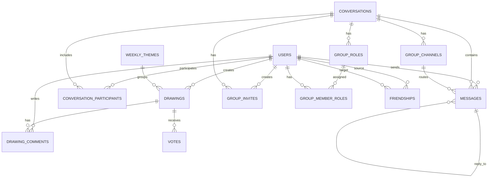

# DoodleVerse backend

Backend ir veidots ar Laravel 11 un nodrošina API, autentifikāciju, reāllaika ziņojumu apraidi un piekļuvi datubāzei.

## Tehnoloģijas

- PHP 8.2+
- Laravel 11
- Laravel Sanctum
- Laravel Reverb
- MySQL

## Startēšana lokāli

```bash
composer install
cp .env.example .env
php artisan key:generate
php artisan migrate
php artisan db:seed
php artisan serve
```

Papildu procesi reāllaikam un rindām:

```bash
php artisan reverb:start
php artisan queue:work
```

## Galvenās mapes

- app/Http/Controllers: API kontrolieri
- app/Models: Eloquent modeļi un relācijas
- app/Events: notikumi, kas tiek apraidīti klientam
- routes/api.php: API maršruti
- routes/channels.php: Reverb kanālu autorizācija
- database/migrations: tabulu shēmas un ārējās atslēgas

## Datu bāzes relācijas

Šeit ir būtiskākās savstarpējās tabulu saites.

### Lietotāji, zīmējumi, komentāri, balsojumi

- drawings.user_id -> users.id (cascade on delete)
- drawing_comments.drawing_id -> drawings.id (cascade on delete)
- drawing_comments.user_id -> users.id (cascade on delete)
- votes.drawing_id -> drawings.id (cascade on delete)
- drawings.theme_id -> weekly_themes.id (set null on delete)

Piezīme: votes tabulā balsojuma identitāte tiek glabāta laukā voter_identifier, nevis caur tiešu user_id FK.

### Sarunas, dalībnieki, ziņojumi

- conversation_participants.conversation_id -> conversations.id (cascade on delete)
- conversation_participants.user_id -> users.id (cascade on delete)
- messages.user_id -> users.id (cascade on delete)
- messages.conversation_id -> conversations.id (nullable, cascade on delete)
- messages.channel_id -> group_channels.id (nullable, set null on delete)
- messages.reply_to_id -> messages.id (nullable, null on delete)
- conversations.owner_id -> users.id (nullable, set null on delete)

### Grupas funkcionalitāte

- group_channels.conversation_id -> conversations.id (cascade on delete)
- group_roles.conversation_id -> conversations.id (cascade on delete)
- group_invites.conversation_id -> conversations.id (cascade on delete)
- group_invites.created_by -> users.id (cascade on delete)
- group_member_roles.conversation_id -> conversations.id (cascade on delete)
- group_member_roles.user_id -> users.id (cascade on delete)
- group_member_roles.role_id -> group_roles.id (cascade on delete)

### Draudzības saites

- friendships.user_id -> users.id (cascade on delete)
- friendships.friend_id -> users.id (cascade on delete)
- unikāls pāris: (user_id, friend_id)

## Relāciju kopskats



## Svarīgākie API bloki

- Autentifikācija: register, login, logout, user
- Galerija: drawings, votes, comments, weekly-theme, weekly-archive
- Sarunas: conversations, messages
- Grupas: channels, roles, invites
- Sociālais slānis: friends
- Administrācija: admin endpoints

## Diagnostika

```bash
type storage\logs\laravel.log
```
