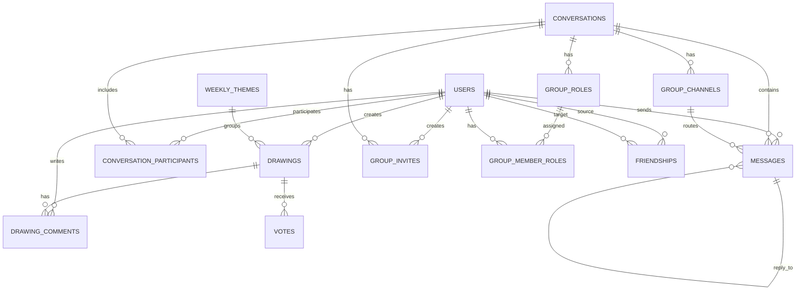

# DoodleVerse backend

Backend ir Laravel 11 lietotnes servera puse. Tā nodrošina API, autentifikāciju, autorizāciju, datu validāciju, reāllaika ziņojumu apraidi, grupu loģiku un administrēšanas galapunktus.

Šajā slānī dzīvo visa biznesa loģika, kas nosaka, kā lietotāji savstarpēji saistās, kā tiek glabāti zīmējumi un kā sarunas tiek organizētas pa kanāliem.

## Tehnoloģiju steks

- PHP 8.2+
- Laravel 11
- Laravel Sanctum
- Laravel Reverb
- MySQL

## Backend atbildība

Backend ir atbildīgs par šādiem uzdevumiem:

- lietotāju reģistrāciju, pieteikšanos un sesiju pārvaldību;
- profila datu atjaunošanu;
- zīmējumu, komentāru un balsu saglabāšanu;
- galerijas datu filtrēšanu un arhīva atgriešanu;
- privāto un grupu sarunu pārvaldību;
- grupu kanālu, lomu un ielūgumu uzturēšanu;
- nedēļas tēmu plānošanu un tematisko zīmējumu piesaisti;
- administratora panelim paredzētu datu sarakstu un darbību nodrošināšanu;
- reāllaika notikumu nosūtīšanu klientam.

## Startēšana lokāli

### Sākotnējā uzstādīšana

```bash
composer install
cp .env.example .env
php artisan key:generate
php artisan migrate
php artisan db:seed
php artisan serve
```

### Papildu servisi

Ja tiek lietots reāllaiks un rindas, palaid arī:

```bash
php artisan reverb:start
php artisan queue:work
```

## Ieteicamā `.env` pārbaude

Pirms palaišanas pārbaudi šos mainīgos:

- `APP_URL`
- `DB_CONNECTION`
- `DB_HOST`
- `DB_DATABASE`
- `DB_USERNAME`
- `DB_PASSWORD`
- `SANCTUM_STATEFUL_DOMAINS`
- `REVERB_APP_KEY`
- `REVERB_APP_SECRET`
- `REVERB_HOST`
- `REVERB_PORT`
- `REVERB_SCHEME`

## Galvenās mapes

- `app/Http/Controllers` — API kontrolieri
- `app/Models` — datu modeļi un relācijas
- `app/Events` — apraides notikumi
- `routes/api.php` — API maršruti
- `routes/channels.php` — kanālu autorizācija
- `database/migrations` — tabulu definīcijas un ārējās atslēgas
- `database/seeders` — sākotnējie dati
- `config` — sistēmas konfigurācija

## Lietotāju plūsmas

### Autentifikācija

Lietotājs piesakās vai reģistrējas, backend izveido Sanctum tokenu, un frontend to izmanto nākamajos API pieprasījumos.

### Zīmējumi

Zīmējuma dati tiek glabāti kā JSON ceļi ar papildus metadatiem. Tas ļauj attēlot darbu galerijā, sarunās un avatāra priekšskatījumā.

### Sarunas

Sarunas var būt privātas vai grupu. Tām var būt dalībnieki, kanāli, lomas, uzaicinājumi un ziņojumi ar atbildēm.

### Administrēšana

Admin maršruti ir aizsargāti ar papildus pārbaudi, kas pieļauj piekļuvi tikai lietotājiem ar `is_admin = true`.

## Kontrolieri

### `AuthController.php`

Apstrādā reģistrāciju, pieteikšanos, izrakstīšanos, pašreizējā lietotāja datu atgriešanu un Google OAuth plūsmu.

### `DrawingController.php`

Pārvalda zīmējumu iegūšanu, izveidi, dzēšanu, balsošanu un balsojuma pārbaudi.

### `DrawingCommentController.php`

Nodrošina zīmējumu komentāru iegūšanu, pievienošanu un dzēšanu.

### `ConversationController.php`

Pārvalda privāto un grupu sarunu izveidi, dalībniekus un ziņojumu izgūšanu.

### `MessageController.php`

Apstrādā ziņojumu sūtīšanu, rediģēšanu, reakcijas, piespraušanu un dzēšanu.

### `GroupChannelController.php`

Pārvalda grupu kanālus, to kārtību un piekļuves datus.

### `GroupRoleController.php`

Pārvalda grupu lomas, to piešķiršanu un atcelšanu.

### `GroupInviteController.php`

Ģenerē uzaicinājumus un apstrādā pievienošanos grupai no ielūguma saites.

### `FriendshipController.php`

Nodrošina draugu pieprasījumus, apstiprināšanu, noraidīšanu un sarakstu izgūšanu.

### `WeeklyThemeController.php`

Atdod pašreizējo nedēļas tēmu un tēmu arhīvu.

### `AdminController.php`

Nodrošina tabulu sarakstus, rediģēšanas un dzēšanas darbības admin panelim.

## Modeļi un relācijas

### `User.php`

Lietotājs ir centrālā entītija. Tam ir zīmējumi, ziņojumi, draudzības saites, sarunu dalība un avatāra dati.

### `Drawing.php`

Zīmējums pieder lietotājam un var būt saistīts ar nedēļas tēmu, balsīm un komentāriem.

### `Message.php`

Ziņojums pieder lietotājam un var būt piesaistīts sarunai, grupas kanālam vai citam ziņojumam kā atbilde.

### `Conversation.php`

Saruna satur dalībniekus, ziņojumus, kanālus, lomas un ielūgumus.

### `GroupChannel.php`

Kanāls pieder sarunai un satur šim kanālam adresētos ziņojumus.

### `GroupRole.php`

Loma pieder sarunai un tiek piešķirta lietotājiem caur starptabulu.

### `GroupInvite.php`

Ielūgums pieder sarunai un lietotājam, kas to izveidojis.

### `Friendship.php`

Draudzības ieraksts satur divus lietotājus un statusu.

### `Vote.php`

Balsojums pieder zīmējumam un tiek identificēts ar `voter_identifier`.

### `DrawingComment.php`

Komentārs pieder zīmējumam un lietotājam.

### `WeeklyTheme.php`

Nedēļas tēma satur nedēļas numuru, gadu, aprakstu, emoji, krāsu un datumu robežas.

## Datu bāzes relācijas

Šī projekta datu modelis ir veidots kā savstarpēji saistītu tabulu tīkls.

### Lietotāji, zīmējumi un galerija

- `drawings.user_id -> users.id` ar `cascade on delete`
- `drawing_comments.drawing_id -> drawings.id` ar `cascade on delete`
- `drawing_comments.user_id -> users.id` ar `cascade on delete`
- `votes.drawing_id -> drawings.id` ar `cascade on delete`
- `drawings.theme_id -> weekly_themes.id` ar `set null on delete`

Praktiski tas nozīmē, ka lietotāja darbi, komentāri un saistītie balsojumi tiek uzturēti konsekventi. Dzēšot zīmējumu, pazūd arī tā komentāri un balsis. Dzēšot tēmu, zīmējums paliek, bet tēmas saite tiek atvienota.

### Sarunas un ziņojumi

- `conversation_participants.conversation_id -> conversations.id` ar `cascade on delete`
- `conversation_participants.user_id -> users.id` ar `cascade on delete`
- `messages.user_id -> users.id` ar `cascade on delete`
- `messages.conversation_id -> conversations.id` kā nullable saite ar `cascade on delete`
- `messages.channel_id -> group_channels.id` kā nullable saite ar `set null on delete`
- `messages.reply_to_id -> messages.id` kā nullable saite ar `null on delete`
- `conversations.owner_id -> users.id` kā nullable saite ar `set null on delete`

Šī shēma ļauj vienai sarunai saturēt vairākus dalībniekus un vairākus kanālus. Ziņojums var piederēt sarunai, kanālam vai būt atbilde uz citu ziņojumu.

### Grupas sistēma

- `group_channels.conversation_id -> conversations.id` ar `cascade on delete`
- `group_roles.conversation_id -> conversations.id` ar `cascade on delete`
- `group_invites.conversation_id -> conversations.id` ar `cascade on delete`
- `group_invites.created_by -> users.id` ar `cascade on delete`
- `group_member_roles.conversation_id -> conversations.id` ar `cascade on delete`
- `group_member_roles.user_id -> users.id` ar `cascade on delete`
- `group_member_roles.role_id -> group_roles.id` ar `cascade on delete`

Grupas saruna ir centrālā vienība, kurai piesaistās kanāli, lomas un uzaicinājumi. Tas ļauj veidot strukturētas kopienas ar konkrētām piekļuves tiesībām.

### Draudzības saites

- `friendships.user_id -> users.id` ar `cascade on delete`
- `friendships.friend_id -> users.id` ar `cascade on delete`
- unikāls pāris `user_id + friend_id`

Draudzības tabula glabā vienvirziena pieprasījumu pāri starp diviem lietotājiem, kam virsū tiek likts statuss. Tas ļauj atdalīt pieprasījumu, apstiprināšanu un bloķēšanu.

## Relāciju kopskats



## API bloki

- Autentifikācija: `register`, `login`, `logout`, `user`
- Galerija: `drawings`, `votes`, `comments`, `weekly-theme`, `weekly-archive`
- Sarunas: `conversations`, `messages`
- Grupas: `channels`, `roles`, `invites`
- Sociālais slānis: `friends`
- Administrācija: `admin`

## API datu tipa uzvedība

- `User` atgriež profila datus, avatāra saites un administrēšanas karogu.
- `Drawing` satur nosaukumu, aprakstu, zīmēšanas datus, balsojumu skaitu un priekšskatījumu.
- `Conversation` satur tipu, nosaukumu, dalībnieku skaitu un piesaistītos kanālus.
- `Message` satur autoru, saturu, atbildes saiti, reakcijas un kanālu vai sarunu sasaisti.

## Diagnostika

```bash
type storage\logs\laravel.log
```
